# Phill Andrade

Em formação em Engenharia de Dados, desenvolvo projetos práticos com pipelines e processamento distribuído.

## 📚 Atualmente estudando

ETL/ELT · Apache Spark · Data Lake/Lakehouse · Data Warehouse · Modelagem Dimensional · Orquestração de pipelines

## 🛠️ Tecnologias e ferramentas

   &nbsp;
   &nbsp;
   &nbsp;
   &nbsp;
   &nbsp;
   &nbsp;
   &nbsp;
   &nbsp;
   &nbsp;
   &nbsp;
   &nbsp;
   &nbsp;
   &nbsp;
  

## 📊 GitHub Stats

  
  

  <picture>
    <source media="(prefers-color-scheme: dark)" srcset="https://raw.githubusercontent.com/Phill-Andrade/Phill-Andrade/output/github-contribution-grid-snake-dark.svg" />
    <source media="(prefers-color-scheme: light)" srcset="https://raw.githubusercontent.com/Phill-Andrade/Phill-Andrade/output/github-contribution-grid-snake.svg" />
    
  </picture>

 <i>Aprendendo, construindo e documentando.</i> 

